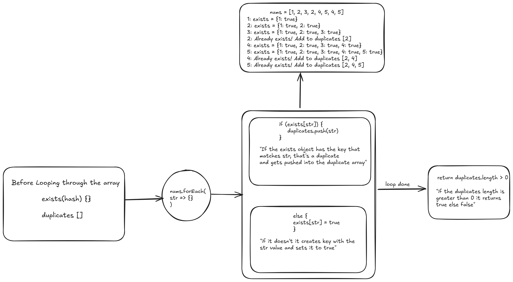

## 01-duplicates

Given an integer array nums, return true if any value appears more than once in the array, otherwise return false.

**Example 1:**

```
Input: nums = [1, 2, 3, 3]

Output: true
```

**Example 2:**

```
Input: nums = [1, 2, 3, 4]

Output: false

```

**Solution**


**Time Complexity: O(n)**

* The algorithm performs a single forEach loop through the array
* Each operation inside the loop (checking exists, pushing to duplicates, setting exists) is O(1)
* We only go through each number once

**Space Complexity: O(n)**

* In worst case (no duplicates), the exists object will store n key-value pairs
* In worst case, duplicates array could store up to n-1 elements (if every element after the first is a duplicate)
* Both data structures could grow linearly with input size